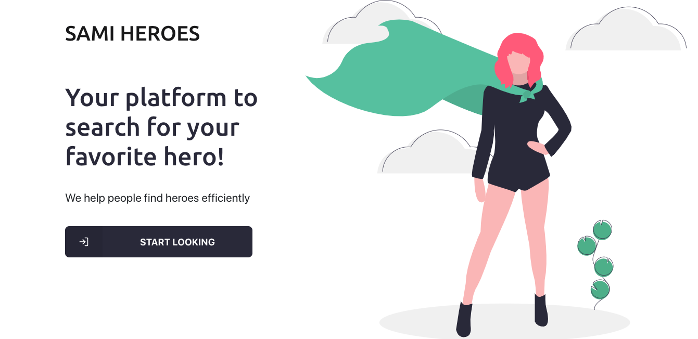

# GIT SEARCH

## 💻 Project

<h1 align="center">
    
</h1>

	
### [Check the site](https://sami-heroes.netlify.app/) :iphone: We are mobile friendly! 


## :rocket: Technologies

This project was developed with the following technologies:

- Node.js
- React
- Redux
- Axios

## :cloud: External API

The web project used an external API to load the users and repositories.

- [SUPERHERO](https://www.superheroapi.com)

## :question: How To Use

To clone and run this application, you'll need [Git](https://git-scm.com), [Node.js](https://nodejs.org/en/) installed on your computer.

From your command line:

### :computer: Install

```bash
# Clone this repository
$ git clone https://github.com/nymalone/superheroes-sami

# Go into the repository
$ cd superheroes-sami

# Install dependencies
$ npm install OR yarn

# Run
$ npm start OR yarn start

# running on port 3000

```

### :palms_up_together: Contributing

You are totally allowed to contribute with this project. To do that, fork this repository, make your changes and create a pull request.

---

<h4 align="center">
    Made with :coffee: and 💜 by <a href="https://www.linkedin.com/in/nykollemalone/" target="_blank">Nykolle Malone</a>
</h4>
